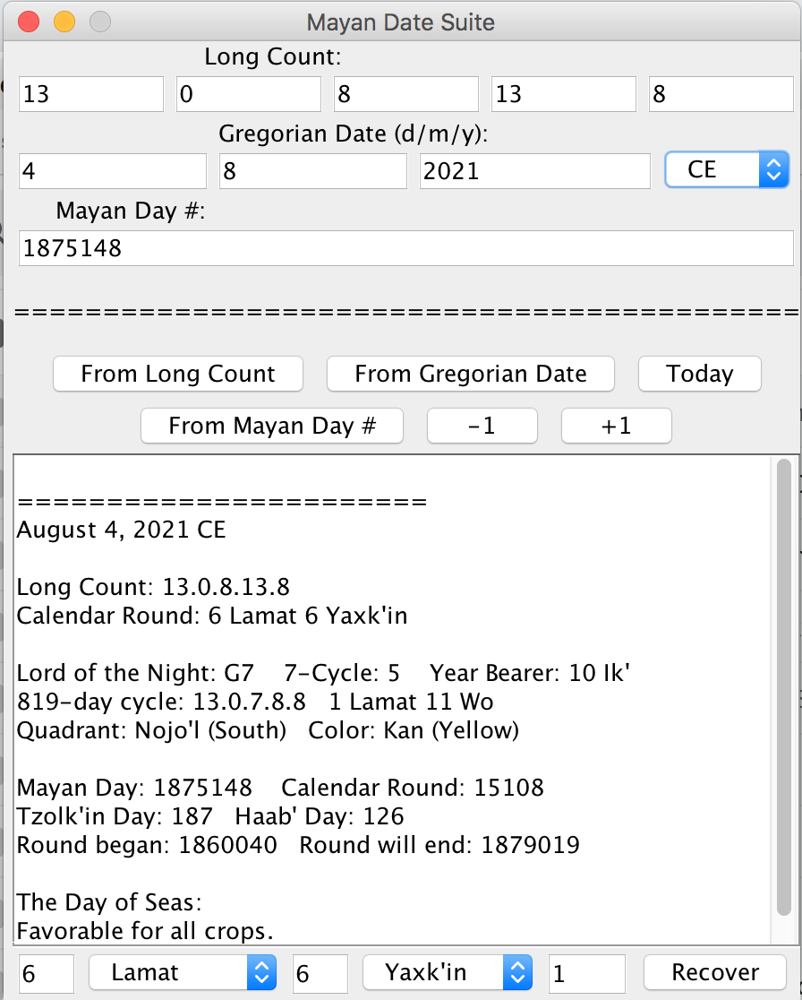

# Mayan Date Calculator

My very first non-trivial coding project, a java applet for calculating Mayan Hieroglyphic dates.
Supports conversion between Gregorian Calendar dates, Mayan Long Count dates, and days since the start of the Mayan Universe.

**A more user-friendly web implementation can be found on [my calculator website](https://polar-gorge-17146.herokuapp.com/).**

*Want a lightweight C widget that prints the current Mayan date? See [here](https://github.com/pinkavat/currentMayanDate)!*

## Installation

Download [MayanDateCalculator.java](MayanDateCalculator.java) and [MayanDate.java](MayanDate.java), place them in a directory, and compile with a java compiler, for instance:
```
javac MayanDateCalculator
```
Compilation will result in two java class files. The compiler may issue some warnings -- the project is very old.

## Usage

Running MayanDateCalculator.class (with MayanDate.class, the calculator code, in the same directory) will open the Calculator GUI:



The fields at the top populate automatically when the dates are computed; the applet will launch with the current date prefilled.

To compute a new date, enter the relevant information in the relevant fields, then press the button below corresponding to which data were entered. The applet will compute the new date, change the fields to match, and print detailed information about the date in the box below.


The bottom of the window contains a prototype function for computing possible dates matching a given Calendar Round. Since the Calendar Round is a cyclic measure of time, it is an insufficient datum to compute an absolute date. 

However, the cycle is 18,980 days long, so if one knows roughly what time period is under consideration (from, say, an incomplete monument), one can guess. 

To use the recovery function, enter the Calendar Round in the given fields, and the number of guesses to make in the last field; then press Recover. The applet will compute *n* possible matching dates (starting from the Mayan Day of creation -- a limitation of the prototype) and print them to the box above.

---

For more information about the Mayan Calendar, consult *Reading the Maya Glyphs*(Coe & Stone, 2001; ISBN 0-500-05110-0) or *Translating Maya Hieroglyphs*(Johnson, 1983; ISBN 978-0-8061-4333-0). Since the Mayan Calendar is by far the most common form of Mayan hieroglyphic writing, it is discussed in most overviews of Mayan epigraphy.
